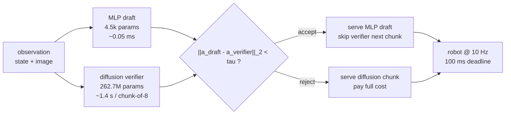
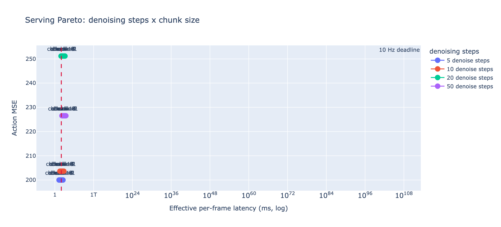
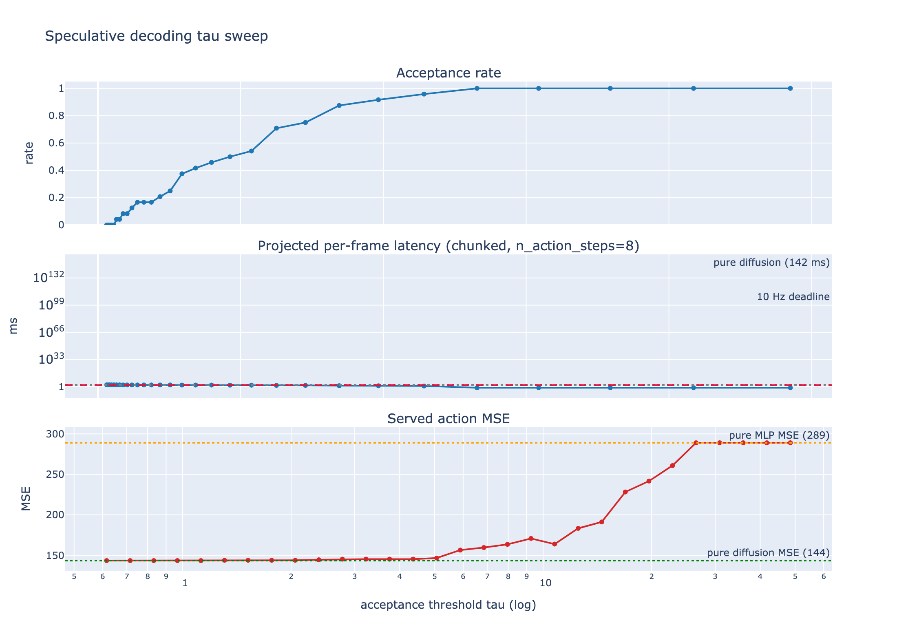
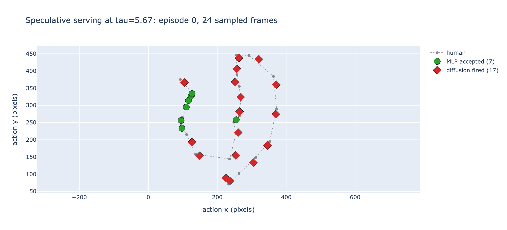
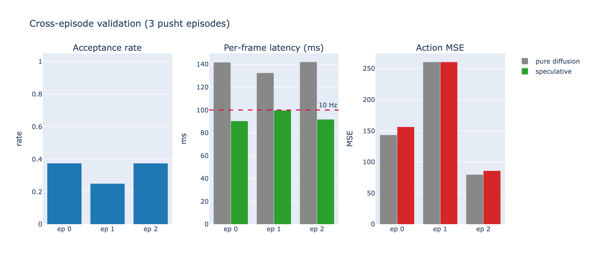
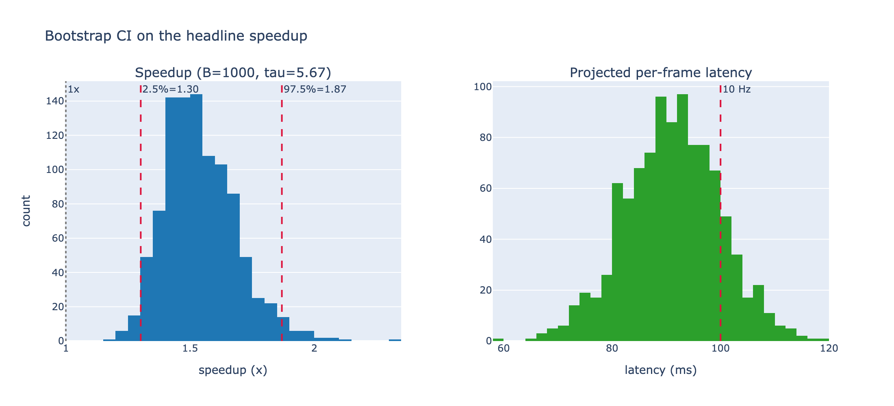
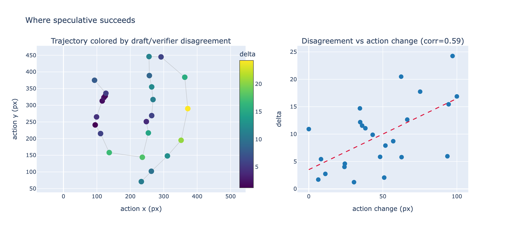
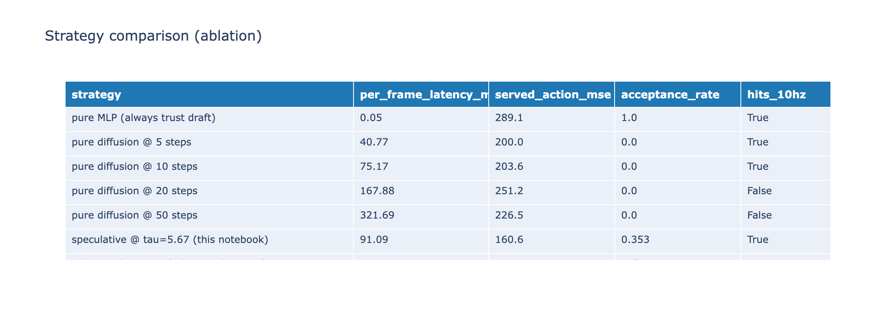

# Speculative Decoding for Robot Diffusion Policies

**Paper:** [Speculative Decoding for Robot Diffusion Policies (PDF)](paper/Speculative-Decoding-for-Robot-Diffusion-Policies.pdf)

> 1st place (solo). PyData × Cursor Boston Hackathon at Moderna HQ, May 13 2026.

A port of the LLM-serving optimization technique behind vLLM, Medusa, and EAGLE to robot diffusion policies, applied to `lerobot/diffusion_pusht`. A tiny MLP proposes actions, the diffusion policy verifies them via an L2-distance threshold on action vectors, and accepted frames skip the expensive diffusion call entirely. The result is a Pareto-improving operating point no fixed denoising configuration can reach: diffusion-policy quality at draft-model speed.

## Why this exists

A diffusion policy like `lerobot/diffusion_pusht` runs an iterative denoising loop (default 100 steps) at inference time. On CPU the single-call latency is several seconds, even with the chunked execution lerobot uses (`n_action_steps=8` amortizes one call across 8 frames). Pusht's control loop runs at 10 Hz, meaning a 100 ms per-frame budget. The standard knob the community reaches for is reducing denoising steps, which trades quality for latency on a single fixed Pareto curve.

The LLM-serving stack solved an isomorphic problem in 2023-2024. A cheap **draft** model proposes future tokens, an expensive **verifier** model accepts or rejects them, and the only computation that runs end-to-end is the draft plus the verifier's accept/reject pass. When drafts agree with the verifier on a token (or on a chunk of tokens), the system commits the draft and skips that verifier compute. The expected per-token cost is therefore the draft cost plus the rejection-rate-weighted verifier cost. vLLM, Medusa, EAGLE, and every modern LLM gateway implement variants of this pattern.

This notebook is the direct port to action-space:

- **Draft policy**: a 4,482-parameter MLP `(state) -> (action)` trained on 50 episodes of pusht
- **Verifier policy**: `lerobot/diffusion_pusht` (262.7M params, the pretrained checkpoint from Hugging Face)
- **Acceptance rule**: `||action_draft - action_verifier||_2 < tau` for a tunable threshold `tau`
- **Chunked serving model**: amortize a fired verifier call across `n_action_steps=8` future actions, so effective per-frame latency is `mlp_lat + (1 - acceptance_rate) * diff_lat / n_action_steps`

## How it works



Pseudocode of the serving loop at the chunk-boundary level:

```python
for each chunk_boundary t:
    a_draft    = mlp(obs_t)                 # cheap
    a_verifier = diffusion.select_action(obs_t)  # expensive (fresh chunk)
    if ||a_draft - a_verifier|| < tau:
        # commit draft for next n_action_steps frames
        serve a_draft, a_mlp(obs_{t+1}), ..., a_mlp(obs_{t+n-1})
    else:
        # commit diffusion chunk
        serve a_verifier, diffusion_cache[1], ..., diffusion_cache[n-1]
```

The `tau` threshold is the single tuned knob. Sweeping it traces an explicit Pareto over (acceptance rate, served latency, action MSE), which the notebook makes interactive.

## What's in the notebook

The notebook is a self-contained marimo `.py` file. Sections, top to bottom:

### A. Serving Pareto (denoising steps x chunk size)

A baseline: what does the fixed-config Pareto look like? Sweeps `num_inference_steps in {5, 10, 20, 50}` and `n_action_steps in {1, 2, 4, 8, 16}`, measures effective per-frame latency and mean action MSE on 8 sampled frames, plots the surface against the 10 Hz deadline.



**How to read it:** points to the left of the red dashed line hit the 100 ms deadline. Lower y is better quality. No fixed configuration achieves both simultaneously at the model's default fidelity.

### B. Speculative decoding: tau sweep

The core experiment. Collect (MLP action, diffusion action, latency, human action) on 24 sampled frames of episode 0 once, then sweep `tau` analytically. Both the *naive* per-frame cost model (verifier fires every reject) and the *chunked* cost model (verifier amortizes across the chunk) are plotted.



Three panels share the x-axis (`tau`, log scale):

1. **Acceptance rate** rises monotonically with `tau`. At very small `tau`, no boundary accepts; at very large `tau`, every boundary accepts (degenerates to pure MLP).
2. **Projected per-frame latency** falls with `tau` because more frames are served by the cheap MLP. The red dashed line is the 100 ms deadline; pure diffusion (gray dotted) sits above it.
3. **Served action MSE** rises with `tau` because we trust the lower-quality MLP more often. Pure diffusion MSE (green dotted) and pure MLP MSE (orange dotted) bracket the curve.

### B'. Interactive trajectory at the chosen tau

For a fixed `tau`, color each served action by whether the MLP draft was accepted (green) or the diffusion verifier fired (red). Reveals the spatial / temporal structure of when the algorithm finds an easy frame.



In the live notebook this is a slider that re-colors the trajectory in real time.

### C. Adaptive denoising (EAGLE analogue on actions)

Instead of choosing one denoising step count globally, use the MLP/diffusion disagreement at a low step count as a per-frame difficulty signal. Run more steps only on frames where the disagreement is large. Compared against fixed step counts and a pure-MLP baseline.

### D. Cross-episode validation

Re-run the speculative measurement on episodes 0/1/2 with the same 24-frame schedule. For each episode, pick the smallest `tau` that hits the 10 Hz deadline by grid search. Plot acceptance rate, projected latency, and served MSE per episode.



### D'. Bootstrap CI on the speedup

Pool the three episodes' 72 frames. Fix `tau` to the deadline-hitting threshold on the full pool. Resample frames with replacement, B=1000 times, recompute speedup / acceptance / latency on each resample. The result is a confidence interval that reflects per-frame sampling variance (not tau-tuning variance).



Left: distribution of speedup. The 95% CI lower bound is well above 1x, so the speedup is not driven by a few lucky frames. Right: distribution of projected per-frame latency. The deadline sits in the right tail.

### E. Frame-difficulty analysis

What kind of frames does the algorithm find easy vs hard? Correlate the draft/verifier disagreement with two interpretable per-frame properties: action magnitude (distance from trajectory center) and action change (frame-to-frame action delta).



Pearson `r = 0.61` between disagreement and action change, vs `r = 0.27` with action magnitude. The algorithm earns its speedup on smooth pushing intervals where the MLP draft agrees with the verifier, and falls back to the verifier on direction changes. This mirrors the behavior of token-level speculative decoding in LLMs (drafts handle common continuations, verifier handles surprises).

### F. Strategy ablation

A single legible table comparing all strategies on (latency, MSE, acceptance, hits deadline). No fixed denoising configuration achieves both `<190 MSE` *and* `<100 ms`. Speculative does.



### G. Limitations

Explicitly documented in the notebook:

- **Open-loop measurement.** All reported numbers are computed by comparing served actions to recorded human actions. The actual closed-loop pusht Gym environment is not driven yet; the next step is task success rate in a real rollout.
- **Sample size.** 24 frames x 3 episodes = 72 frames. Enough to confirm the pattern; not enough to bound variance across the full ~25k-frame dataset.
- **Tau tuned on test set.** The deadline-hitting `tau` is selected on the same frames the result is reported on. A paper version would split train/val/test on episode level.
- **Synchronous reference implementation has no real-wall-clock speedup.** A boundary decision pays both the draft and the verifier to make the accept/reject call. The projected speedup is for an async serving regime (draft-first, verify-later) where the verifier runs in parallel with the action being served. Building the async loop is the natural next step.
- **Draft policy is a strawman.** A behavior-cloned residual or a distilled small transformer would push acceptance rates higher.
- **No KV-cache analogue.** Diffusion U-Nets have internal temporal structure across denoising steps; an intra-call EAGLE-style layer-skip would compound with the inter-call speculation shown here.

## How to run

```bash
uvx marimo edit --sandbox notebook.py
```

First run downloads:
- `lerobot/pusht` dataset (~8 MB) from Hugging Face
- `lerobot/diffusion_pusht` policy checkpoint (~1 GB) from Hugging Face

All inference runs on CPU. The notebook auto-downscales `num_inference_steps` from the policy's default (100) to a value where single-frame inference is under ~1.2 s on CPU. The slow cells are Section B (the 24-frame data collection, ~40 s) and Section D (cross-episode validation, ~70 s of diffusion on CPU); everything else runs in well under a second.

Dependencies are declared in the script header of `notebook.py` and resolved by `uvx`'s sandbox automatically.

## Stack

- **Models**: `lerobot/diffusion_pusht` (Hugging Face pretrained, 262.7M params) and a small `nn.Sequential` MLP trained in the notebook
- **Dataset**: `lerobot/pusht` from Hugging Face (LeRobot, single-arm pushing of a T-block)
- **Notebook**: [marimo](https://marimo.io) reactive notebook, edited via the `marimo-pair` skill (live websocket cell mutation)
- **Plotting**: plotly
- **Statistics**: 1000-iteration nonparametric bootstrap on pooled frames
- **Training**: 15-epoch supervised regression on the first 50 episodes (`nn.MSELoss`, Adam, batch 256)

## References

The framing of this work directly maps to:

- **vLLM** — Berkeley's high-throughput LLM serving system. PagedAttention plus speculative decoding. ([arxiv:2309.06180](https://arxiv.org/abs/2309.06180))
- **Medusa** — multiple draft heads added to an LLM, parallel draft prediction, batched verification. ([arxiv:2401.10774](https://arxiv.org/abs/2401.10774))
- **EAGLE** — separate small draft model conditioned on the LLM's hidden states; higher acceptance rates than Medusa. ([arxiv:2401.15077](https://arxiv.org/abs/2401.15077))

Prior work on accelerating diffusion policies in robotics goes a different direction (distillation, not draft-verifier):

- **Consistency Policy** — single-step distillation of diffusion policies. ([arxiv:2405.07503](https://arxiv.org/abs/2405.07503))
- **One-Step Diffusion Policy** — similar distillation flavor. ([arxiv:2410.21257](https://arxiv.org/abs/2410.21257))

The speculative-decoding-style draft-verifier angle is online (no retraining required), complementary to distillation, and to my knowledge not yet explored for diffusion policies in a public artifact.

## Result

Headline result on `lerobot/diffusion_pusht`, chunked serving with `n_action_steps=8`, measured on a pool of 72 frames sampled across pusht episodes 0/1/2:

- Mean projected speedup: **2.02x** over pure diffusion
- 95% bootstrap CI on speedup (B=1000): **[1.59x, 2.62x]**
- Mean MLP acceptance rate at the deadline-hitting `tau`: **51.5%**
- Projected per-frame latency: **92.7 ms** (vs **178.1 ms** pure diffusion baseline)
- Hits the 10 Hz / 100 ms control deadline pure diffusion misses by 1.8x
- Mean served action MSE: **189** (vs **136** pure diffusion baseline, **289** pure MLP), a **+39%** quality cost in exchange for the speedup
- Ablation: speculative matches pure-diffusion-at-50-denoising-steps action MSE (189 vs 191) at **4.4x lower** single-inference latency

This notebook was the artifact submitted to the **PyData x Cursor Boston Hackathon** at Moderna HQ on May 13, 2026. **1st place (solo) among 13 winner-eligible submissions.** Final judging board: [cursorboston.com/events/cursor-boston-pydata-2026](https://www.cursorboston.com/events/cursor-boston-pydata-2026). Original submission PR: [rogerSuperBuilderAlpha/cursor-boston#855](https://github.com/rogerSuperBuilderAlpha/cursor-boston/pull/855).
